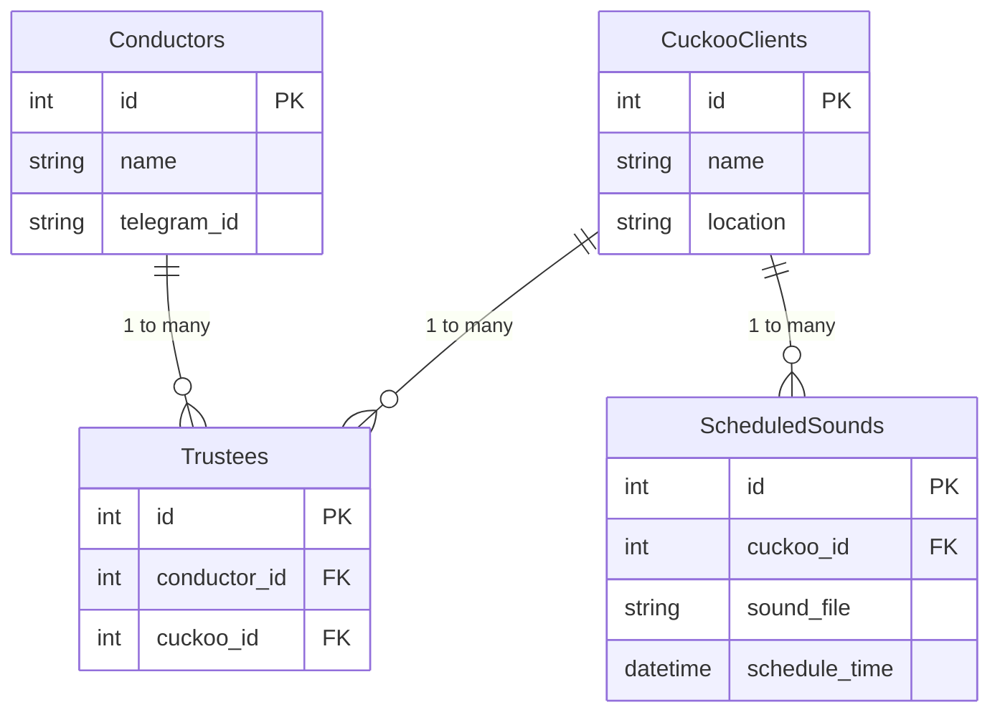
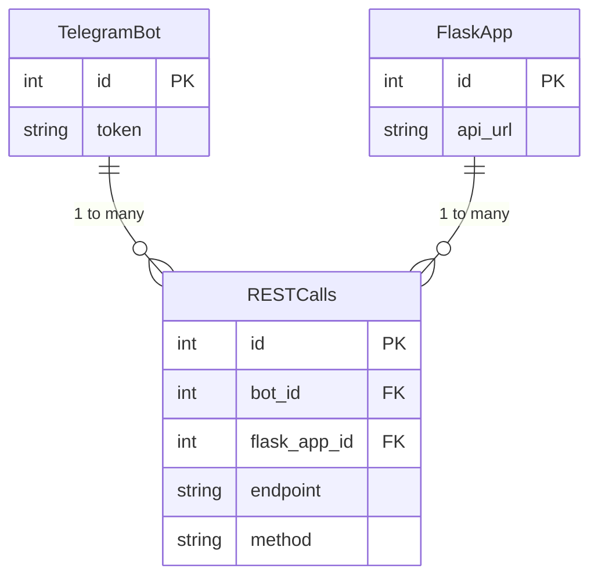

# Cuckoo Project

## Description

Cuckoo Project enables scheduling of custom sounds on a distributed mesh of clients ("Cuckoos") through a Telegram bot interface. Authorized users, called "Conductors," can remotely program Cuckoo clients to play sounds according to a schedule. The system stores schedules per user and Cuckoo client ID using a PostgreSQL database.

## Features

- Remote scheduling of sounds via Telegram bot
- Multi-client support with distributed Cuckoos
- Role-based access control with Conductors and Trustees
- Containerized deployment using Docker Compose

## Architecture Overview

The system consists of:

- **Telegram Bot**: Interface for Conductors to schedule sounds.
- **Flask Application**: Backend API handling schedules and permissions.
- **PostgreSQL Database**: Stores Conductors, Cuckoo clients, Trustees, and scheduled sounds.
- **Cuckoo Clients**: Devices that play scheduled sounds.

## Database ERD 



## Bot and Flask Interaction ERD



- **Telegram Bot**: Manages interaction with users via Telegram.
- **Flask Application**: Handles backend logic and database interactions.
- **REST Calls**: Defines the API endpoints and methods used for communication between the Telegram Bot and Flask Application.

- **Conductors**: Registered users who schedule sounds.
- **Cuckoo Clients**: Devices that play the sounds.
- **Trustees**: Permissions table linking Conductors to Cuckoo Clients.
- **Scheduled Sounds**: Stores sound schedules linked to specific Cuckoo Clients.

## Prerequisites

- Docker and Docker Compose
- Telegram bot token
- Python 3.11

## Installation and Setup

1. Clone the repository:
   ```bash
   git clone https://github.com/baruchli/cuckoo_project.git
   cd cuckoo_project
   ```
2. Configure environment variables in `.env` file:
   ```env
   TELEGRAM_BOT_TOKEN=your_bot_token_here
   DATABASE_URL=postgresql://user:password@db:5432/cuckoo_db
   ```
3. Start the application using Docker Compose:
   ```bash
   docker-compose up --build
   ```

## Usage

- Use Telegram to communicate with the bot for scheduling sounds.
- Registration flow for Conductors is **to be defined**.

## API Endpoints

- **POST /schedule**: Create a new sound schedule
- **GET /schedules**: List all schedules for a Conductor
- **DELETE /schedule/{id}**: Remove a scheduled sound

## Contribution Guidelines

Contributions are welcome! Please submit pull requests with descriptive commit messages.
